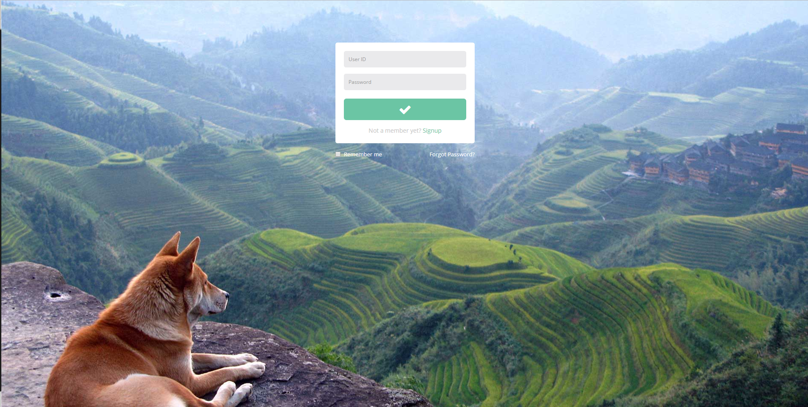
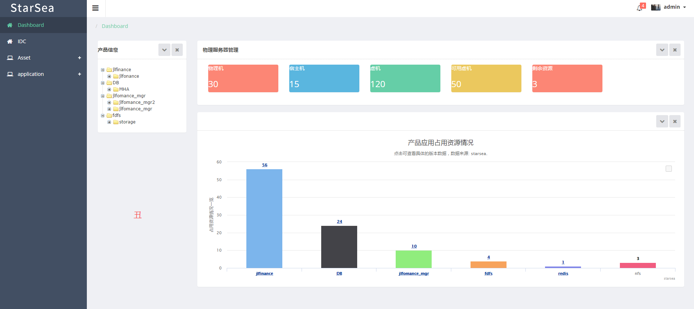
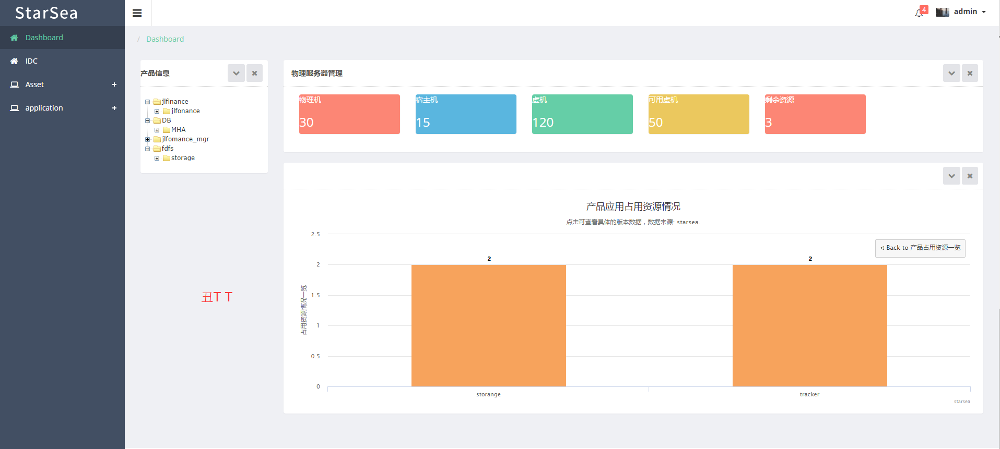

# starsea
* 基于flask,前后端分离的运维平台
* 前端,后端都根据功能可拆分部署,一个目录是一单独项目
* python3.5
### 登陆

### auth
用户首次登陆获取到token,通过token与后端通信
### 动态菜单
后端根据用户权限生成菜单
### CMDB
服务器资源池
### product
产品线管理
### application
应用管理
### deploy
### IP管理
IP池
### DNS管理
### 日志记录
用户对数据增删改查日志记录,用户发布记录
